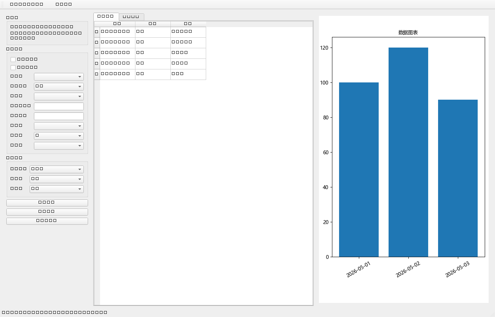

# Desktop Data Analyzer EXE

一个面向本地 Excel 文件的轻量桌面数据分析器。

它适合不想写代码、但希望快速完成 Excel 数据整理、查看、图表预览和结果导出的用户。项目同时提供 Python 源码与 Windows 目录版 `.exe` 打包能力。

## 下载与运行（Release 版）

如果你只是想直接使用程序，**优先到 GitHub Releases 下载发布包**，不要只拿单独的 `.exe` 文件。

原因是这个项目当前采用的是 **PyInstaller 目录版打包**，运行时除了 `desktop-data-analyzer.exe` 之外，还依赖同目录下的 `_internal/` 文件夹中的 DLL、Qt 插件、Python 扩展和文档资源。

**正确的下载方式：**

1. 进入仓库的 Releases 页面
2. 下载 `desktop-data-analyzer-exe-v0.1.0-windows.zip`
3. 解压整个 zip 包
4. 保持 `desktop-data-analyzer.exe` 与 `_internal/` 文件夹在同一个目录层级
5. 双击运行 `desktop-data-analyzer.exe`

**不要做的事情：**

- 不要只复制 `desktop-data-analyzer.exe` 单文件到别处运行
- 不要删除 `_internal/` 文件夹
- 不要把 exe 和 `_internal/` 拆开

## 这个项目是干什么的

这个项目的目标是把常见的本地 Excel 处理流程做成一个可直接运行的桌面工具，避免每次都手动在 Excel 里反复点选，或者为了简单处理专门写脚本。

当前版本支持：

- 导入本地 `.xlsx` 和 `.xls` 文件
- 默认读取首个工作表
- 查看原始数据与处理结果
- 去除全空行
- 去除重复行
- 按关键词筛选
- 按列升序 / 降序排序
- 按两列做加减乘除生成新列
- 生成柱状图和折线图
- 导出处理结果为新的 Excel 文件
- 记录运行日志，便于排查问题
- 构建 Windows 目录版 `.exe`

## 这个 exe 是干什么的

`exe` 是这个项目给普通用户使用的桌面程序版本。

如果你不想安装 Python、不想配环境，也不想自己运行源码，可以直接使用打包后的 `desktop-data-analyzer.exe` 来完成 Excel 导入、处理、图表查看和导出。

适合的对象包括：

- 运营、销售、财务、人事等日常处理 Excel 的人员
- 需要快速核对表格和导出结果的小团队成员
- 想在本地离线分析数据、避免上传第三方平台的用户

## 界面里能做什么

程序主界面主要分为三块：

1. 左侧控制区
   - 数据源信息
   - 处理配置
   - 图表配置
   - 执行处理 / 导出结果 / 重置工作区
2. 中间数据表区域
   - 原始数据
   - 处理结果
3. 右侧图表区域
   - 柱状图
   - 折线图

主工具栏还提供：

- `导入 Excel`
- `新手引导`

## 界面截图

> 下面这张截图基于示例数据自动生成，用于展示当前版本的大致界面布局。



## exe 怎么使用

### 快速使用步骤

1. 启动 `desktop-data-analyzer.exe`
2. 点击主工具栏中的 **导入 Excel**
3. 选择本地 `.xlsx` 或 `.xls` 文件
4. 在左侧确认工作表、行数、列数
5. 按需要勾选去空行、去重、筛选、排序或计算列
6. 点击 **执行处理**
7. 在中间查看处理结果，在右侧查看图表
8. 点击 **导出结果** 保存为新的 `.xlsx`

### 新手引导

点击主工具栏中的 **新手引导** 后，可以选择两种模式：

- **分步引导**：逐步介绍每个关键按钮和区域的作用
- **完整说明**：一次性展示完整使用文档

### 日志位置

程序运行时会在应用根目录下创建：

- `logs/runtime.log`

日志会记录：

- 启动信息
- 导入行为
- 处理行为
- 图表异常
- 导出行为
- 错误堆栈

如果 exe 使用过程中出现问题，建议优先查看这个日志文件。

## 源码运行方式

### 安装依赖

```powershell
pip install -r requirements.txt
```

### 启动程序

```powershell
python main.py
```

### 运行测试

```powershell
python -m pytest -v
```

### 构建 exe

```powershell
python scripts/build_exe.py
```

构建完成后，产物目录在：

```text
dist/desktop-data-analyzer/
```

## 项目结构

```text
app/                 启动层与状态
ui/                  主窗口、面板、表格模型、新手引导
services/            Excel、图表、处理、日志服务
tests/               自动化测试
docs/                用户说明与设计/计划文档
sample_data/         示例 Excel 文件
scripts/             构建脚本
```

## 常见问题

### 1. 为什么导入失败？

可能原因：

- 文件损坏
- 文件格式不是 `.xlsx` 或 `.xls`
- 文件被其他程序占用
- 文件内容异常，无法被 pandas / openpyxl / xlrd 正常读取

请优先查看：

```text
logs/runtime.log
```

### 2. 为什么图表没显示？

可能原因：

- 没有选择分类列或数值列
- 处理结果为空
- 数值列中存在无法转换为数字的内容

当前版本会自动跳过一部分非数字脏数据，但如果整列都不可用，就不会绘图。

### 3. 为什么导出失败？

可能原因：

- 目标文件已被其他程序打开
- 目标目录没有写入权限
- 当前没有可导出的处理结果

### 4. 为什么不能只下载一个 exe？

因为当前发布的是 **目录版应用**，exe 只是启动入口，真正运行还依赖 `_internal/` 目录中的动态库和插件资源。

所以 Release 中必须下载并解压完整 zip 包，而不是只保留 exe 文件。

## 适用边界

当前版本是一个轻量原型级桌面工具，适合本地单文件数据处理场景，不包含：

- 多工作表复杂流程编排
- 批量文件任务调度
- 高级 BI 图表系统
- 云端协作与在线共享

## 许可证

本项目使用仓库内的 `LICENSE` 文件。

当前许可证允许：

- 学习
- 阅读源码
- 个人非商用使用
- 非商用修改与参考

当前许可证不允许：

- 商业销售
- 商业分发
- 商业 SaaS / 商业集成
- 将本项目或其衍生版本用于直接或间接营利

使用前请阅读完整许可证条款。
